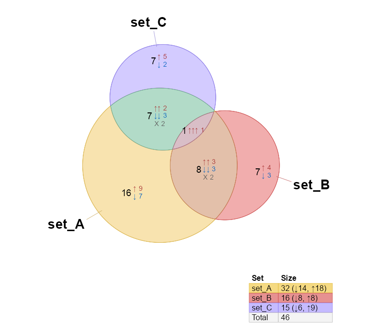
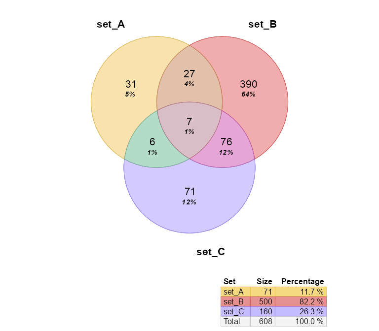

<!-- README.md is generated from README.Rmd. Please edit that file -->

# venndir

<!-- badges: start -->
<!-- badges: end -->

The `venndir` package provides Venn directional diagrams, that can
optionally display item labels inside the overlap regions.

The `pkgdown` reference:
[jmw86069.github.io/venndir](https://jmw86069.github.io/venndir)

## Installation

The development version of venndir can be installed with:

``` r
# install.packages("remotes")
remotes::install_github("jmw86069/venndir");
```

## Features of venndir

The core is `venndir()` which takes a `setlist` as input and produces a
Venn diagram. When the `setlist` contains directionality (sign), the
directional overlaps are also displayed.

To illustrate the point, `make_venn_test()` is used to create test
`setlist` data.

``` r
# silence the GEOS warnings
options("warn"=-1)

library(venndir)
setlist <- make_venn_test(100, 3)
setlist
#> $set_A
#>  [1] "item_067" "item_042" "item_050" "item_043" "item_014" "item_025"
#>  [7] "item_090" "item_091" "item_069" "item_093" "item_057" "item_009"
#> [13] "item_072" "item_026" "item_007" "item_099" "item_089" "item_083"
#> [19] "item_036" "item_078" "item_097" "item_076" "item_015" "item_032"
#> [25] "item_086" "item_084" "item_041" "item_023" "item_027" "item_060"
#> [31] "item_053" "item_079"
#> 
#> $set_B
#>  [1] "item_053" "item_027" "item_096" "item_038" "item_089" "item_034"
#>  [7] "item_093" "item_069" "item_072" "item_076" "item_063" "item_013"
#> [13] "item_082" "item_025" "item_097" "item_021"
#> 
#> $set_C
#>  [1] "item_079" "item_041" "item_047" "item_090" "item_060" "item_095"
#>  [7] "item_016" "item_006" "item_072" "item_086" "item_091" "item_039"
#> [13] "item_031" "item_081" "item_050"
```

A `setlist` is a list of vectors. The names of the list, one for each
vector, are the set names. Each vector contains items which are the
subject of the Venn overlaps.

Given a `setlist`, you can create a Venn diagram with `venndir()`:

``` r
venndir(setlist)
```


You can make a proportional Venn diagram, also known as a Euler diagram.
More examples of proportional Venn diagrams are described below, but for
now the simplest approach is to add argument `proportional=TRUE`:

``` r
venndir(setlist,
   overlap_type="overlap",
   proportional=TRUE)
```


The default output use base R graphics, but you can use `ggplot2` with
the argument `plot_style="gg"`:

``` r
venndir(setlist,
   overlap_type="overlap",
   proportional=TRUE,
   plot_style="gg")
```


Finally, you can add a legend with `venndir_legender()`:

``` r
vo <- venndir(setlist,
   proportional=TRUE,
   overlap_type="overlap",
   show_segments=FALSE,
   plot_style="gg")
venndir_legender(setlist=setlist, venndir_out=vo, font_cex=0.8)
```


The function invisibly returns the `ggplot` object which can be
manipulated alongside other `grid` graphical objects.

## Venn Direction

For a more interesting case, `make_venn_test(..., do_signed=TRUE)`
creates a `setlist` with directionality (sign), which means each item is
associated with a numerical direction:

- `+1` for up
- `-1` for down

In this case, each vector in the `setlist` is a named vector, whose
**names** are the items, and whose **values** are the signed direction
`+1` or `-1`. Take a look.

``` r
setlist_dir <- make_venn_test(100, 3, do_signed=TRUE)
setlist_dir
#> $set_A
#> item_067 item_042 item_050 item_043 item_014 item_025 item_090 item_091 
#>       -1        1        1       -1       -1        1       -1       -1 
#> item_069 item_093 item_057 item_009 item_072 item_026 item_007 item_099 
#>       -1        1        1       -1        1        1       -1       -1 
#> item_089 item_083 item_036 item_078 item_097 item_076 item_015 item_032 
#>       -1        1        1        1        1        1       -1        1 
#> item_086 item_084 item_041 item_023 item_027 item_060 item_053 item_079 
#>        1        1       -1        1       -1        1        1       -1 
#> 
#> $set_B
#> item_053 item_027 item_096 item_038 item_089 item_034 item_093 item_069 
#>        1       -1        1       -1       -1       -1        1       -1 
#> item_072 item_076 item_063 item_013 item_082 item_025 item_097 item_021 
#>        1        1        1        1        1       -1       -1       -1 
#> 
#> $set_C
#> item_079 item_041 item_047 item_090 item_060 item_095 item_016 item_006 
#>       -1       -1        1       -1        1        1        1       -1 
#> item_072 item_086 item_091 item_039 item_031 item_081 item_050 
#>        1        1        1        1       -1        1       -1
```

For biological data, direction is important and relevant. Whether a gene
is regulated up or down might be the difference between disease and
treatment.

> Note `make_venn_tests()` can simulate concordance, and the default is
> `concordance=0.5`. Concordance is a measure of how frequently two
> directions are the same, and is defined `(agree - disagree) / (n)`.
> Thus, `concordance=0` means there are the same number that agree as
> disagree in direction, and `concordance=1` means every element agrees
> in direction.

There are a few ways to summarize directional overlaps, which vary by
the amount of detail.

- `overlap_type="overlap"` - This method ignores direction.
- `overlap_type="agreement"` - This method displays agreement and
  disagreement, with no details about up/down direction.
- `overlap_type="concordance"` - **(default)** This method displays
  concordant directions, up-up, down-down; all discordant combinations
  are grouped together as “discordant”.
- `overlap_type="each"` - This method displays each directional overlap.

### overlap_type=“concordance”

Let’s start with `overlap_type="concordance"` which displays the number
`up-up`, and the number `down-down`, and everything else is considered
“discordant”. This approach is effective at conveying direction, without
too many unhelpful details.

``` r
venndir(setlist_dir)
```


It is mostly helpful when you want to see how many overlaps agree up and
down, and when the overlaps that disagree in direction are less
interesting. For example, sometimes the overlaps are mostly `up-up` and
rarely `down-down`, which can be very helpful to know.

### overlap_type=“each”

The option `overlap_type="each"` shows the count for each directional
combination. It works best when you want to see all the details,
typically for only 2 or 3 sets.

``` r
venndir(setlist_dir, overlap_type="each")
```


### overlap_type=“agreement”

The option `overlap_type="agreement"` shows the count for each overlap
that agrees in direction, regardless of the direction; and the count for
overlaps that disagree in direction.

This option is especially good at summarizing the number that agree and
disagree, without including potentially confusing details.

``` r
venndir(setlist_dir, overlap_type="agreement")
```


### overlap_type=“overlap”

The option `overlap_type="overlap"` simply ignores directionality.

``` r
venndir(setlist_dir, overlap_type="overlap")
```


## Proportional Venn Direction

As shown above, you can switch output to a proportional Venn diagram,
which uses the really nice `eulerr` R package.

``` r
vo <- venndir(setlist_dir,
   proportional=TRUE,
   font_cex=c(1.3, 0.9, 0.7))
venndir_legender(setlist_dir, venndir_out=vo, x="bottomright", font_cex=0.6)
```



Labeling is often a challenge with proportional Venn diagrams. By
default, for directional Venn counts, if a polygon is less than 5% of
the total area, the label is placed outside. For standard Venn counts
the default threshold is 1%.

Below is the same diagram, showing only the overlap counts, and not the
directional counts.

``` r
venndir(setlist,
   proportional=TRUE,
   overlap_type="overlap",
   label_style="lite",
   font_cex=c(1.3, 1))
```


You can change the threshold for placing labels outside with the
argument `inside_percent_threshold`, which takes integer percent values
from 0 to 100.

``` r
venndir(setlist,
   proportional=TRUE,
   inside_percent_threshold=0.1,
   overlap_type="overlap",
   font_cex=c(1.3, 1))
```


## Customizing the Venn diagram

The output of `venndir()` is a `list` with:

- `"venn_spdf"` - which contains polygon coordinates stored as a
  `sp::SpatialPolygonsDataFrame`. Essentially it stores each Venn
  polygon, with annotations in a `data.frame`.
- `"label_df"` - a `data.frame` with individual text labels, colors, and
  coordinates.

You can edit the `label_df` data manually, as needed, then render the
Venn diagram using `render_venndir()`. (I really like having a function
named `render_venndir()`…)

``` r
setlist <- make_venn_test(1000, 3, do_signed=FALSE)
vo <- venndir(setlist, proportional=TRUE, do_plot=FALSE);

print(head(vo$label_df));
#>                  x     y text venn_counts overlap_set type x_offset y_offset
#> set_A       -8.730 -1.53   31          31       set_A main   -3.516   -0.998
#> set_B        8.855 -4.38  390         390       set_B main    9.603   -3.716
#> set_C       -4.662  9.95   71          71       set_C main   -0.888    4.745
#> set_A&set_B -4.140 -2.24   27          27 set_A&set_B main    0.000    0.000
#> set_A&set_C -6.591  2.59    6           6 set_A&set_C main   -3.353    1.592
#> set_B&set_C  0.117  4.73   76          76 set_B&set_C main    0.000    0.000
#>             show_label vjust hjust halign rot     color fontsize border lty lwd
#> set_A               NA   0.5   0.5    0.5   0 #262626FF       14     NA   1   1
#> set_B               NA   0.5   0.5    0.5   0 #262626FF       14     NA   1   1
#> set_C               NA   0.5   0.5    0.5   0 #262626FF       14     NA   1   1
#> set_A&set_B         NA   0.5   0.5    0.5   0 #262626FF       14     NA   1   1
#> set_A&set_C         NA   0.5   0.5    0.5   0 #262626FF       14     NA   1   1
#> set_B&set_C         NA   0.5   0.5    0.5   0 #262626FF       14     NA   1   1
#>             fill padding padding_unit r r_unit      overlap_sign        items
#> set_A         NA       3           pt 3     pt       set_A|1 0 0 item_052....
#> set_B         NA       3           pt 3     pt       set_B|0 1 0 item_011....
#> set_C         NA       3           pt 3     pt       set_C|0 0 1 item_059....
#> set_A&set_B   NA       3           pt 3     pt set_A&set_B|1 1 0 item_019....
#> set_A&set_C   NA       3           pt 3     pt set_A&set_C|1 0 1 item_093....
#> set_B&set_C   NA       3           pt 3     pt set_B&set_C|0 1 1 item_060....
#>             nsets main_venn_counts overlap set_is_hidden show_items   count
#> set_A           1               31 outside         FALSE       none  inside
#> set_B           1              390 outside         FALSE       none  inside
#> set_C           1               71 outside         FALSE       none  inside
#> set_A&set_B     2               27    none         FALSE       none  inside
#> set_A&set_C     2                6    none         FALSE       none outside
#> set_B&set_C     2               76    none         FALSE       none  inside
#>             label_left_outside label_left_inside label_right_outside
#> set_A                     TRUE              TRUE               FALSE
#> set_B                     TRUE              TRUE               FALSE
#> set_C                     TRUE              TRUE               FALSE
#> set_A&set_B              FALSE              TRUE               FALSE
#> set_A&set_C               TRUE             FALSE               FALSE
#> set_B&set_C              FALSE              TRUE               FALSE
#>             label_right_inside hjust_outside hjust_inside vjust_outside
#> set_A                    FALSE           0.5          0.5           0.5
#> set_B                    FALSE           0.5          0.5           0.5
#> set_C                    FALSE           0.5          0.5           0.5
#> set_A&set_B              FALSE           0.5          0.5           0.5
#> set_A&set_C              FALSE           1.0          0.5           0.0
#> set_B&set_C              FALSE           0.5          0.5           0.5
#>             vjust_inside
#> set_A                0.5
#> set_B                0.5
#> set_C                0.5
#> set_A&set_B          0.5
#> set_A&set_C          0.5
#> set_B&set_C          0.5

vo$label_df[1:3,"border"] <- c("red4", "darkorange", "blue4");
vo$label_df[1:3,"fill"] <- c("red3", "darkorange2", "blue3");
render_venndir(vo);
```


A convenience function `venndir_label_style()` is provided which
provides two features:

1.  It can adjust a label positions and visibility using `label_preset`.
2.  It can adjust label visual style using `label_style`.

### venndir_label_style() and label_preset

The `label_preset` has a few pre-configured options:

- `"main inside"` - displays main set labels, and counts inside each
  polygon.
- `"main outside"` - displays each set label outside, and counts inside.
- `"outside"` - displays set labels and counts outside.
- `"main items"` - displays set names outside, and item labels inside
  each polygon. See below for examples.

``` r
vo4 <- venndir_label_style(vo,
   label_preset="main outside",
   inside_percent_threshold=0)
render_venndir(vo4);
```


You can hide line segments with `show_segments=FALSE`.

``` r
vo4l <- venndir_label_style(vo,
   label_preset="main outside",
   inside_percent_threshold=0)
render_venndir(vo4l,
   show_segments=FALSE);
```



### venndir_label_style() and label_style

The `label_style` is used for visual effects, to improve visibility of
the text labels. It applies two basic operations, fill and border.

Fill options:

- `"basic"` - removes background fill
- `"shaded"` - partial transparent fill using the overlap color
- `"fill"` - fill using the overlap color
- `"lite"` - lite shaded fill
- `"custom"` - will not update the fill, in case you manually adjusted
  these values

Border options:

- `"box"` - will draw a border around each label
  \*`*`““`- absence of`”box”`in`label_style\` will remove any border

The `label_style` string can be any string that contains those values,
for example:

- `label_style="lite box"`
- `label_style="shaded"`
- `label_style="basic box"`

``` r
vo3 <- venndir_label_style(vo,
   inside_percent_threshold=0,
   label_style="lite box")
render_venndir(vo3);
```


## Text Venn for the R Console

There is a text Venn diagram, surprisingly useful for quickly checking
overlaps and direction. Note that the R console, and R help examples
display colored text, just not in Rmarkdown.

The first example is the basic Venn overlap, without direction.

``` r
setlist <- make_venn_test(1000, 3, do_signed=TRUE)
textvenn(setlist, overlap_type="overlap")
#>                                 set_A&set_B                                     
#>                                     27                                          
#>    set_A                                                              set_B     
#>     31                                                                 390      
#>                                                                                 
#>                              set_A&set_B&set_C                                  
#>                                      7                                          
#>              set_A&set_C                              set_B&set_C               
#>                   6                                       76                    
#>                                                                                 
#>                                                                                 
#>                                    set_C                                        
#>                                     71
```

But of course direction is helpful, so here it is with the default
`overlap_type="concordance"` (below)

``` r
textvenn(setlist, overlap_type="concordance")
#>                                         set_A&set_B     ↑↑: 9                                          
#>                                             27          ↓↓: 12                                         
#>    set_A  ↑: 19                                          X: 6                           set_B  ↑: 185  
#>     31    ↓: 12                                                                          390   ↓: 205  
#>                                                                                                        
#>                                      set_A&set_B&set_C  ↑↑↑: 2                                         
#>                                              7           X: 5                                          
#>                  set_A&set_C  ↑↑: 2                                set_B&set_C  ↑↑: 39                 
#>                       6       ↓↓: 3                                    76       ↓↓: 21                 
#>                               X: 1                                              X: 16                  
#>                                                                                                        
#>                                            set_C        ↑: 30                                          
#>                                             71          ↓: 41
```

Not all consoles can display Unicode arrows, so you can use ASCII output
only with `unicode=FALSE`:

``` r
textvenn(setlist, overlap_type="concordance", unicode=FALSE)
#>                                         set_A&set_B     ^^: 9                                          
#>                                             27          vv: 12                                         
#>    set_A  ^: 19                                          X: 6                           set_B  ^: 185  
#>     31    v: 12                                                                          390   v: 205  
#>                                                                                                        
#>                                      set_A&set_B&set_C  ^^^: 2                                         
#>                                              7           X: 5                                          
#>                  set_A&set_C  ^^: 2                                set_B&set_C  ^^: 39                 
#>                       6       vv: 3                                    76       vv: 21                 
#>                               X: 1                                              X: 16                  
#>                                                                                                        
#>                                            set_C        ^: 30                                          
#>                                             71          v: 41
```

Sorry, no proportional text Venn diagrams (yet)!

## Nudge Venn circles

Another driving reason for this package is that sometimes proportional
Venn (Euler) diagrams fail to produce circles that show all the
overlaps. While sometimes it is mathematically impossible, other times
are just… puzzling.

See below, the overlap `set_A&set_B` has 1 count, but is not displayed.

``` r
overlaps <- c(set_A=187, set_B=146, set_C=499,
   `set_A&set_B`=1,
   `set_A&set_C`=181,
   `set_B&set_C`=219,
   `set_A&set_B&set_C`=20);
# convert to setlist
setlist_o <- counts2setlist(overlaps)

venndir(setlist_o,
   proportional=TRUE,
   font_cex=1.4,
   set_colors=c("firebrick2", "dodgerblue", "#9999AA"))
```


The argument `circle_nudge` lets you nudge (move) a Venn circle given
x,y coordinates. Provide a `list` named by the set you want to move,
with a `numeric` vector for the `x,y` coordinates direction.

``` r
vo_nudge <- venndir(setlist_o,
   font_cex=1.4,
   proportional=TRUE,
   circle_nudge=list(set_A=c(1, 0), set_B=c(-1, 0)),
   set_colors=c("firebrick2", "dodgerblue", "#9999AA"))
```


## Item labels

An optional but useful feature is to include item labels inside the Venn
diagram. It helps answer the question, “What are those shared items?”
(In my experience, that’s a very early question.)

This step can also include the directional sign, which helps indicate
which items are shared, and whether they have the same direction. In
cases with too many labels to display, it is sometimes still useful to
display the sign, as a visual cue for the proportion of shared or
discordant signs.

Two arguments are required: the `label_preset` to define the visibility
of items and main set labels; and `show_items` to define the type of
item label. For example `label_preset="main items"` will display main
set labels outside, and item labels inside; and `show_items="item"` will
display the item label, `show_items="sign item"` will display the sign
and item label, `show_items="sign"` will display only the sign.

``` r
setlist <- make_venn_test(100, 3, do_signed=TRUE);
venndir(setlist,
   poly_alpha=0.3,
   label_preset="main items",
   show_items="sign item");
```


Interestingly, the density of labels gives some indication of the
relative overlaps.

The same plot using proportional circles makes the label density
effectively uniform:

``` r
setlist <- make_venn_test(100, 3, do_signed=TRUE);
venndir(setlist,
   poly_alpha=0.3,
   label_preset="main items",
   show_items="item",
   proportional=TRUE);
```


With too many features to label, it’s still interesting to indicate the
sign.

``` r
setlist <- make_venn_test(1000, 3, do_signed=TRUE);
venndir(setlist,
   label_preset="main items",
   show_items="sign",
   item_cex=3,
   show_segments=FALSE,
   max_items=10000);
```


Again, proportional Venn circles effectively makes the density uniform.

``` r
venndir(setlist,
   label_preset="main items",
   overlap_type="each",
   show_items="sign",
   item_cex=4,
   max_items=10000,
   show_segments=FALSE,
   proportional=TRUE);
```


