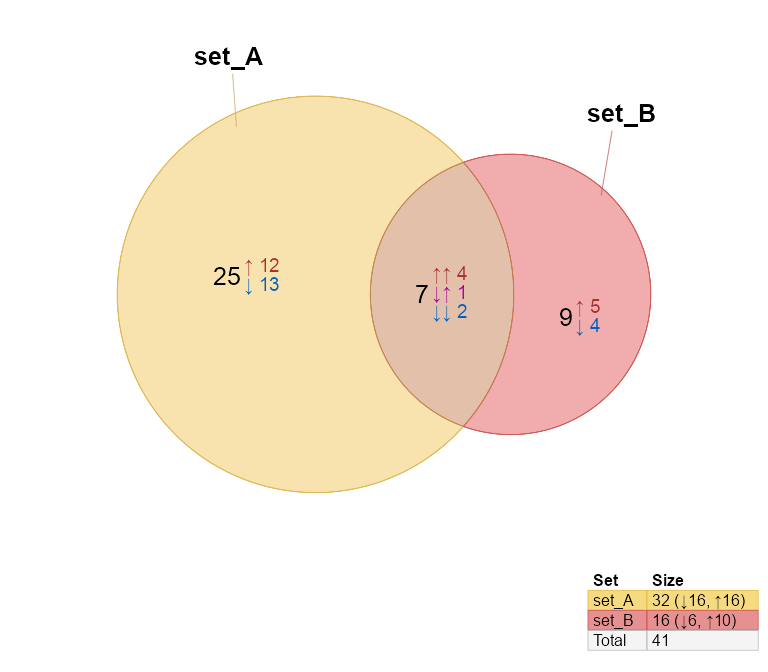
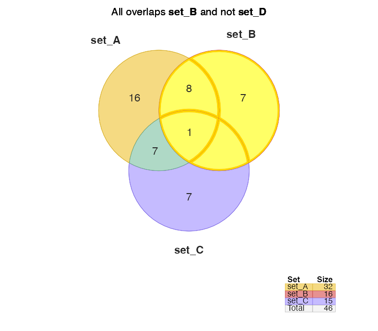

<!-- README.md is generated from README.Rmd. Please edit that file -->

# venndir

<!-- badges: start -->
<!-- badges: end -->

The `venndir` package provides Venn directional diagrams, that can
optionally display item labels inside the overlap regions.

The `pkgdown` reference:
[jmw86069.github.io/venndir](https://jmw86069.github.io/venndir)

## Installation

The development version of venndir can be installed with:

``` r
# install.packages("remotes")
remotes::install_github("jmw86069/venndir");
```

## Why Venndir?

Biological data often involves components, for example genes, and the
direction of change, for example increase or decrease. It is not enough
to compare genes affected by two experiments, it is critical to compare
the direction of change. How else can we discriminate the effects of
disease from the effects of a cure?

``` r
# silence the warnings
options("warn"=-1)

library(venndir)

vo <- venndir(make_venn_test(100, 2, do_signed=TRUE),
   proportional=TRUE,
   overlap_type="each", font_cex=1.2)
```



## Features of venndir

The core is `venndir()` which takes a `setlist` as input and produces a
Venn diagram. When the `setlist` contains directionality (sign), the
directional overlaps are also displayed.

To illustrate the point, `make_venn_test()` is used to create test
`setlist` data.

``` r
setlist <- make_venn_test(100, 3)
setlist
#> $set_A
#>  [1] "item_067" "item_042" "item_050" "item_043" "item_014" "item_025"
#>  [7] "item_090" "item_091" "item_069" "item_093" "item_057" "item_009"
#> [13] "item_072" "item_026" "item_007" "item_099" "item_089" "item_083"
#> [19] "item_036" "item_078" "item_097" "item_076" "item_015" "item_032"
#> [25] "item_086" "item_084" "item_041" "item_023" "item_027" "item_060"
#> [31] "item_053" "item_079"
#> 
#> $set_B
#>  [1] "item_053" "item_027" "item_096" "item_038" "item_089" "item_034"
#>  [7] "item_093" "item_069" "item_072" "item_076" "item_063" "item_013"
#> [13] "item_082" "item_025" "item_097" "item_021"
#> 
#> $set_C
#>  [1] "item_079" "item_041" "item_047" "item_090" "item_060" "item_095"
#>  [7] "item_016" "item_006" "item_072" "item_086" "item_091" "item_039"
#> [13] "item_031" "item_081" "item_050"
```

A `setlist` is a list of vectors. The names of the list, one for each
vector, are the set names. Each vector contains items which are the
subject of the Venn overlaps.

Given a `setlist`, you can create a Venn diagram with `venndir()`:

``` r
venndir(setlist)
```


You can make a proportional Venn diagram, also known as a Euler diagram.
Add argument `proportional=TRUE`.

``` r
vo <- venndir(setlist,
   proportional=TRUE)
```


## Venn Direction

The namesake of this package is Venn with directionality!

Test with: `make_venn_test(..., do_signed=TRUE)`. Each item is
associated with a numerical direction:

- `+1` for up
- `-1` for down

Each vector in `setlist_dir` is a named vector, whose **names** are the
items, and whose **values** are the direction, with `+1` or `-1`. Take a
look.

``` r
setlist_dir <- make_venn_test(100, 3, do_signed=TRUE)
setlist_dir
#> $set_A
#> item_067 item_042 item_050 item_043 item_014 item_025 item_090 item_091 
#>       -1        1        1       -1       -1        1       -1       -1 
#> item_069 item_093 item_057 item_009 item_072 item_026 item_007 item_099 
#>       -1        1        1       -1        1        1       -1       -1 
#> item_089 item_083 item_036 item_078 item_097 item_076 item_015 item_032 
#>       -1        1        1        1        1        1       -1        1 
#> item_086 item_084 item_041 item_023 item_027 item_060 item_053 item_079 
#>        1        1       -1        1       -1        1        1       -1 
#> 
#> $set_B
#> item_053 item_027 item_096 item_038 item_089 item_034 item_093 item_069 
#>        1       -1        1       -1       -1       -1        1       -1 
#> item_072 item_076 item_063 item_013 item_082 item_025 item_097 item_021 
#>        1        1        1        1        1       -1       -1       -1 
#> 
#> $set_C
#> item_079 item_041 item_047 item_090 item_060 item_095 item_016 item_006 
#>       -1       -1        1       -1        1        1        1       -1 
#> item_072 item_086 item_091 item_039 item_031 item_081 item_050 
#>        1        1        1        1       -1        1       -1
```

For biological data, **direction is important and relevant**. Up- or
down-regulation might be the difference between disease or treatment.

> Note `make_venn_tests()` can simulate concordance, and the default is
> `concordance=0.5`. Concordance is a measure of how frequently two
> directions are the same, and is defined `(agree - disagree) / (n)`.
> Thus, `concordance=0` means there are the same number that agree as
> disagree in direction, and `concordance=1` means every element agrees
> in direction.

There are different ways to summarize directional overlaps:

- `overlap_type="concordance"` - **(default for signed input)**:
  Concordant up 191, down 193, and discordant X.
- `overlap_type="overlap"` - **(default for basic input)**: Overlap
  counts only.
- `overlap_type="agreement"` - Agreement and disagreement.
- `overlap_type="each"` - Counts for each combination of directions.

### overlap_type=“concordance”

``` r
venndir(setlist_dir, font_cex=c(1.5, 1.5, 1))
```


This approach is effective at conveying direction, without too many
details.

### overlap_type=“each”

``` r
venndir(setlist_dir, overlap_type="each")
```


This option shows the count for each combination.

### overlap_type=“agreement”

``` r
venndir(setlist_dir, overlap_type="agreement")
```


This option is preferred for overall agreement, without all the details.

### overlap_type=“overlap”

``` r
venndir(setlist_dir, overlap_type="overlap")
```


Venn “Classic”.

## Proportional Venn Direction

Add argument `proportional=TRUE` to display a proportional Venn diagram
(Euler diagram), which uses the excellent `eulerr` R package.

``` r
vo <- venndir(setlist_dir,
   proportional=TRUE,
   font_cex=c(1.3, 0.9, 0.7))
```


Labeling is a challenge with proportional Venn diagrams, venndir has
several options to help optimize, and customize label placement.
(Bookdown docs forthcoming.)

For very small overlap regions, `inside_percent_threshold=5` will move
labels outside when the area is less than 5% of the total.

``` r
venndir(setlist_dir,
   proportional=TRUE,
   label_style="lite box",
   inside_percent_threshold=5,
   font_cex=c(1.3, 1))
```


## Customizing the Venn diagram

Labels can be customized with shading, border, and placed inside or
outside the Venn area.

### Label styles

The argument `label_style` can be used to customize the label:

- `label_style="lite"` - adds lite shading behind each label
- `label_style="shaded"` - adds partially transparent shading
- `label_style="fill"` - adds solid colored shading
- `label_style="box"` - adds a small outline box around the label

Multiple terms can be combined, for example to add shading and a box:

- `label_style="shaded box"` - adds colored shading and a box outline

### Label position

Argument `show_labels` is used to position labels. Each letter defines a
type of label, and UPPERCASE or lowercase indicates where to place the
label.

- UPPERCASE = outside the Venn diagram
- lowercase = inside the Venn diagram

The letters:

- N = the set name
- C = the overlap count
- S = the signed overlap count(s)
- i = the overlapping items

Guidance:

- The default: `show_labels="Ncs"` will show \_N_ame outside, \_c_ounts
  inside. When \_s_igned labels are shown, they also appear inside.
  Signed labels are not shown when `overlap_type="overlap"`.
- Display all labels inside: `show_labels="ncs"`
- It works best to have the \_c_ounts and \_s_igned counts together,
  usually inside.
- To display items, `show_labels="Ni"` is recommended, to show \_N_ame
  outside, and \_i_tems inside. You can still use
  `show_items="sign item"` so that each item label will include the
  direction.
- When displaying items, the counts and signed counts are automatically
  moved outside. (There isn’t a great way to place item labels around
  the count labels. Maybe in future.)

``` r
vo4 <- venndir(setlist,
   show_labels="ncs",
   inside_percent_threshold=0)
```


Hide line segments with `show_segments=FALSE`

``` r
vo4l <- venndir(setlist,
   show_labels="Ncs",
   show_segments=FALSE,
   inside_percent_threshold=0)
```


## Highlights

Specific overlaps can be modified or highlighted, using either
`modify_venndir_overlap()` or `highlight_venndir_overlap()`. Labels can
be adjusted, moved, resized, etc.

``` r
vo4h <- highlight_venndir_overlap(vo4l,
   outerborder="red", outerborder.lwd=3,
   overlap_set="set_A&set_B")
render_venndir(vo4h, main="Highlight for **set_A&set_B**")
```


``` r

vo4h <- highlight_venndir_overlap(vo4l,
   overlap_set=unique(grep("set_B", vo4l@jps@polygons$venn_name, value=TRUE)))
render_venndir(vo4h, main="All overlaps **set_B** and not **set_D**")
```



## Text Venn for the R Console

Text Venn diagrams are surprisingly convenient for remote server work!
(Output is colorized, not colorized in RMarkdown.)

The first example is the basic Venn overlap, without direction.

``` r
# Options are used for the RMarkdown
# options("jam.htmlOut"=TRUE, "jam.comment"=FALSE)

setlist <- make_venn_test(1000, 3, do_signed=TRUE)
names(setlist) <- gsub("set_", "", names(setlist));
textvenn(setlist, overlap_type="overlap", htmlOut=TRUE)
```

<span style="font-family: monospace"><span style="color:#837471FF">    </span><span style="color:#837471FF">   </span><span style="color:#837471FF">     </span><span style="color:#837471FF">   </span><span style="color:#000000FF;background-color:#CE926CFF">  A&B  </span><span style="color:#837471FF">   </span><span style="color:#837471FF">   </span><span style="color:#837471FF">     </span><span style="color:#837471FF">   </span><span style="color:#837471FF">     </span><span style="color:#837471FF">   </span></span><br/>
<span style="font-family: monospace"><span style="color:#837471FF">    </span><span style="color:#837471FF">   </span><span style="color:#837471FF">     </span><span style="color:#837471FF">   </span><span style="color:#A9A9C7FF">  27   </span><span style="color:#837471FF">   </span><span style="color:#837471FF">   </span><span style="color:#837471FF">     </span><span style="color:#837471FF">   </span><span style="color:#837471FF">     </span><span style="color:#837471FF">   </span></span><br/>
<span style="font-family: monospace"><span style="color:#000000FF;background-color:#EEC12EFF"> A  </span><span style="color:#837471FF">   </span><span style="color:#837471FF">     </span><span style="color:#837471FF">   </span><span style="color:#837471FF">       </span><span style="color:#837471FF">   </span><span style="color:#837471FF">   </span><span style="color:#837471FF">     </span><span style="color:#837471FF">   </span><span style="color:#FFFFFFFF;background-color:#D54848FF">  B  </span><span style="color:#837471FF">   </span></span><br/>
<span style="font-family: monospace"><span style="color:#A8A8C8FF"> 31 </span><span style="color:#837471FF">   </span><span style="color:#837471FF">     </span><span style="color:#837471FF">   </span><span style="color:#837471FF">       </span><span style="color:#837471FF">   </span><span style="color:#837471FF">   </span><span style="color:#837471FF">     </span><span style="color:#837471FF">   </span><span style="color:#3F007DFF"> 390 </span><span style="color:#837471FF">   </span></span><br/>
<span style="font-family: monospace"><span style="color:#837471FF">    </span><span style="color:#837471FF">   </span><span style="color:#837471FF">     </span><span style="color:#837471FF">   </span><span style="color:#837471FF">       </span><span style="color:#837471FF">   </span><span style="color:#837471FF">   </span><span style="color:#837471FF">     </span><span style="color:#837471FF">   </span><span style="color:#837471FF">     </span><span style="color:#837471FF">   </span></span><br/>
<span style="font-family: monospace"><span style="color:#837471FF">    </span><span style="color:#837471FF">   </span><span style="color:#837471FF">     </span><span style="color:#837471FF">   </span><span style="color:#000000FF;background-color:#BF92A2FF"> A&B&C </span><span style="color:#837471FF">   </span><span style="color:#837471FF">   </span><span style="color:#837471FF">     </span><span style="color:#837471FF">   </span><span style="color:#837471FF">     </span><span style="color:#837471FF">   </span></span><br/>
<span style="font-family: monospace"><span style="color:#837471FF">    </span><span style="color:#837471FF">   </span><span style="color:#837471FF">     </span><span style="color:#837471FF">   </span><span style="color:#AAA9BCFF">   7   </span><span style="color:#837471FF">   </span><span style="color:#837471FF">   </span><span style="color:#837471FF">     </span><span style="color:#837471FF">   </span><span style="color:#837471FF">     </span><span style="color:#837471FF">   </span></span><br/>
<span style="font-family: monospace"><span style="color:#837471FF">    </span><span style="color:#837471FF">   </span><span style="color:#000000FF;background-color:#79C0A0FF"> A&C </span><span style="color:#837471FF">   </span><span style="color:#837471FF">       </span><span style="color:#837471FF">   </span><span style="color:#837471FF">   </span><span style="color:#FFFFFFFF;background-color:#D162B8FF"> B&C </span><span style="color:#837471FF">   </span><span style="color:#837471FF">     </span><span style="color:#837471FF">   </span></span><br/>
<span style="font-family: monospace"><span style="color:#837471FF">    </span><span style="color:#837471FF">   </span><span style="color:#AAA9BBFF">  6  </span><span style="color:#837471FF">   </span><span style="color:#837471FF">       </span><span style="color:#837471FF">   </span><span style="color:#837471FF">   </span><span style="color:#9996C7FF"> 76  </span><span style="color:#837471FF">   </span><span style="color:#837471FF">     </span><span style="color:#837471FF">   </span></span><br/>
<span style="font-family: monospace"><span style="color:#837471FF">    </span><span style="color:#837471FF">   </span><span style="color:#837471FF">     </span><span style="color:#837471FF">   </span><span style="color:#837471FF">       </span><span style="color:#837471FF">   </span><span style="color:#837471FF">   </span><span style="color:#837471FF">     </span><span style="color:#837471FF">   </span><span style="color:#837471FF">     </span><span style="color:#837471FF">   </span></span><br/>
<span style="font-family: monospace"><span style="color:#837471FF">    </span><span style="color:#837471FF">   </span><span style="color:#837471FF">     </span><span style="color:#837471FF">   </span><span style="color:#837471FF">       </span><span style="color:#837471FF">   </span><span style="color:#837471FF">   </span><span style="color:#837471FF">     </span><span style="color:#837471FF">   </span><span style="color:#837471FF">     </span><span style="color:#837471FF">   </span></span><br/>
<span style="font-family: monospace"><span style="color:#837471FF">    </span><span style="color:#837471FF">   </span><span style="color:#837471FF">     </span><span style="color:#837471FF">   </span><span style="color:#000000FF;background-color:#9F8DFFFF">   C   </span><span style="color:#837471FF">   </span><span style="color:#837471FF">   </span><span style="color:#837471FF">     </span><span style="color:#837471FF">   </span><span style="color:#837471FF">     </span><span style="color:#837471FF">   </span></span><br/>
<span style="font-family: monospace"><span style="color:#837471FF">    </span><span style="color:#837471FF">   </span><span style="color:#837471FF">     </span><span style="color:#837471FF">   </span><span style="color:#9C99C8FF">  71   </span><span style="color:#837471FF">   </span><span style="color:#837471FF">   </span><span style="color:#837471FF">     </span><span style="color:#837471FF">   </span><span style="color:#837471FF">     </span><span style="color:#837471FF">   </span></span><br/>

But of course direction is helpful, so here it is with the default
`overlap_type="concordance"` (below)

``` r
textvenn(setlist, overlap_type="concordance", htmlOut=TRUE)
```

<span style="font-family: monospace"><span style="color:#837471FF">    </span><span style="color:#837471FF">       </span><span style="color:#837471FF">     </span><span style="color:#837471FF">       </span><span style="color:#000000FF;background-color:#CE926CFF">  A&B  </span><span style="color:#B22222FF"> ↑↑: 9  </span><span style="color:#837471FF">   </span><span style="color:#837471FF">     </span><span style="color:#837471FF">        </span><span style="color:#837471FF">     </span><span style="color:#837471FF">        </span></span><br/>
<span style="font-family: monospace"><span style="color:#837471FF">    </span><span style="color:#837471FF">       </span><span style="color:#837471FF">     </span><span style="color:#837471FF">       </span><span style="color:#A9A9C7FF">  27   </span><span style="color:#1874CDFF"> ↓↓: 12 </span><span style="color:#837471FF">   </span><span style="color:#837471FF">     </span><span style="color:#837471FF">        </span><span style="color:#837471FF">     </span><span style="color:#837471FF">        </span></span><br/>
<span style="font-family: monospace"><span style="color:#000000FF;background-color:#EEC12EFF"> A  </span><span style="color:#B22222FF"> ↑: 19 </span><span style="color:#837471FF">     </span><span style="color:#837471FF">       </span><span style="color:#837471FF">       </span><span style="color:#7F706DFF">  X: 6  </span><span style="color:#837471FF">   </span><span style="color:#837471FF">     </span><span style="color:#837471FF">        </span><span style="color:#FFFFFFFF;background-color:#D54848FF">  B  </span><span style="color:#B22222FF"> ↑: 185 </span></span><br/>
<span style="font-family: monospace"><span style="color:#A8A8C8FF"> 31 </span><span style="color:#1874CDFF"> ↓: 12 </span><span style="color:#837471FF">     </span><span style="color:#837471FF">       </span><span style="color:#837471FF">       </span><span style="color:#837471FF">        </span><span style="color:#837471FF">   </span><span style="color:#837471FF">     </span><span style="color:#837471FF">        </span><span style="color:#3F007DFF"> 390 </span><span style="color:#1874CDFF"> ↓: 205 </span></span><br/>
<span style="font-family: monospace"><span style="color:#837471FF">    </span><span style="color:#837471FF">       </span><span style="color:#837471FF">     </span><span style="color:#837471FF">       </span><span style="color:#837471FF">       </span><span style="color:#837471FF">        </span><span style="color:#837471FF">   </span><span style="color:#837471FF">     </span><span style="color:#837471FF">        </span><span style="color:#837471FF">     </span><span style="color:#837471FF">        </span></span><br/>
<span style="font-family: monospace"><span style="color:#837471FF">    </span><span style="color:#837471FF">       </span><span style="color:#837471FF">     </span><span style="color:#837471FF">       </span><span style="color:#000000FF;background-color:#BF92A2FF"> A&B&C </span><span style="color:#B22222FF"> ↑↑↑: 2 </span><span style="color:#837471FF">   </span><span style="color:#837471FF">     </span><span style="color:#837471FF">        </span><span style="color:#837471FF">     </span><span style="color:#837471FF">        </span></span><br/>
<span style="font-family: monospace"><span style="color:#837471FF">    </span><span style="color:#837471FF">       </span><span style="color:#837471FF">     </span><span style="color:#837471FF">       </span><span style="color:#AAA9BCFF">   7   </span><span style="color:#7F706DFF">  X: 5  </span><span style="color:#837471FF">   </span><span style="color:#837471FF">     </span><span style="color:#837471FF">        </span><span style="color:#837471FF">     </span><span style="color:#837471FF">        </span></span><br/>
<span style="font-family: monospace"><span style="color:#837471FF">    </span><span style="color:#837471FF">       </span><span style="color:#000000FF;background-color:#79C0A0FF"> A&C </span><span style="color:#B22222FF"> ↑↑: 2 </span><span style="color:#837471FF">       </span><span style="color:#837471FF">        </span><span style="color:#837471FF">   </span><span style="color:#FFFFFFFF;background-color:#D162B8FF"> B&C </span><span style="color:#B22222FF"> ↑↑: 39 </span><span style="color:#837471FF">     </span><span style="color:#837471FF">        </span></span><br/>
<span style="font-family: monospace"><span style="color:#837471FF">    </span><span style="color:#837471FF">       </span><span style="color:#AAA9BBFF">  6  </span><span style="color:#1874CDFF"> ↓↓: 3 </span><span style="color:#837471FF">       </span><span style="color:#837471FF">        </span><span style="color:#837471FF">   </span><span style="color:#9996C7FF"> 76  </span><span style="color:#1874CDFF"> ↓↓: 21 </span><span style="color:#837471FF">     </span><span style="color:#837471FF">        </span></span><br/>
<span style="font-family: monospace"><span style="color:#837471FF">    </span><span style="color:#837471FF">       </span><span style="color:#837471FF">     </span><span style="color:#7F706DFF"> X: 1  </span><span style="color:#837471FF">       </span><span style="color:#837471FF">        </span><span style="color:#837471FF">   </span><span style="color:#837471FF">     </span><span style="color:#7F706DFF"> X: 16  </span><span style="color:#837471FF">     </span><span style="color:#837471FF">        </span></span><br/>
<span style="font-family: monospace"><span style="color:#837471FF">    </span><span style="color:#837471FF">       </span><span style="color:#837471FF">     </span><span style="color:#837471FF">       </span><span style="color:#837471FF">       </span><span style="color:#837471FF">        </span><span style="color:#837471FF">   </span><span style="color:#837471FF">     </span><span style="color:#837471FF">        </span><span style="color:#837471FF">     </span><span style="color:#837471FF">        </span></span><br/>
<span style="font-family: monospace"><span style="color:#837471FF">    </span><span style="color:#837471FF">       </span><span style="color:#837471FF">     </span><span style="color:#837471FF">       </span><span style="color:#000000FF;background-color:#9F8DFFFF">   C   </span><span style="color:#B22222FF"> ↑: 30  </span><span style="color:#837471FF">   </span><span style="color:#837471FF">     </span><span style="color:#837471FF">        </span><span style="color:#837471FF">     </span><span style="color:#837471FF">        </span></span><br/>
<span style="font-family: monospace"><span style="color:#837471FF">    </span><span style="color:#837471FF">       </span><span style="color:#837471FF">     </span><span style="color:#837471FF">       </span><span style="color:#9C99C8FF">  71   </span><span style="color:#1874CDFF"> ↓: 41  </span><span style="color:#837471FF">   </span><span style="color:#837471FF">     </span><span style="color:#837471FF">        </span><span style="color:#837471FF">     </span><span style="color:#837471FF">        </span></span><br/>

Use `unicode=FALSE` if the console font does not support unicode arrows.

``` r
textvenn(setlist, overlap_type="concordance", unicode=FALSE, htmlOut=TRUE)
```

<span style="font-family: monospace"><span style="color:#837471FF">    </span><span style="color:#837471FF">       </span><span style="color:#837471FF">     </span><span style="color:#837471FF">       </span><span style="color:#000000FF;background-color:#CE926CFF">  A&B  </span><span style="color:#B22222FF"> ^^: 9  </span><span style="color:#837471FF">   </span><span style="color:#837471FF">     </span><span style="color:#837471FF">        </span><span style="color:#837471FF">     </span><span style="color:#837471FF">        </span></span><br/>
<span style="font-family: monospace"><span style="color:#837471FF">    </span><span style="color:#837471FF">       </span><span style="color:#837471FF">     </span><span style="color:#837471FF">       </span><span style="color:#A9A9C7FF">  27   </span><span style="color:#1874CDFF"> vv: 12 </span><span style="color:#837471FF">   </span><span style="color:#837471FF">     </span><span style="color:#837471FF">        </span><span style="color:#837471FF">     </span><span style="color:#837471FF">        </span></span><br/>
<span style="font-family: monospace"><span style="color:#000000FF;background-color:#EEC12EFF"> A  </span><span style="color:#B22222FF"> ^: 19 </span><span style="color:#837471FF">     </span><span style="color:#837471FF">       </span><span style="color:#837471FF">       </span><span style="color:#7F706DFF">  X: 6  </span><span style="color:#837471FF">   </span><span style="color:#837471FF">     </span><span style="color:#837471FF">        </span><span style="color:#FFFFFFFF;background-color:#D54848FF">  B  </span><span style="color:#B22222FF"> ^: 185 </span></span><br/>
<span style="font-family: monospace"><span style="color:#A8A8C8FF"> 31 </span><span style="color:#1874CDFF"> v: 12 </span><span style="color:#837471FF">     </span><span style="color:#837471FF">       </span><span style="color:#837471FF">       </span><span style="color:#837471FF">        </span><span style="color:#837471FF">   </span><span style="color:#837471FF">     </span><span style="color:#837471FF">        </span><span style="color:#3F007DFF"> 390 </span><span style="color:#1874CDFF"> v: 205 </span></span><br/>
<span style="font-family: monospace"><span style="color:#837471FF">    </span><span style="color:#837471FF">       </span><span style="color:#837471FF">     </span><span style="color:#837471FF">       </span><span style="color:#837471FF">       </span><span style="color:#837471FF">        </span><span style="color:#837471FF">   </span><span style="color:#837471FF">     </span><span style="color:#837471FF">        </span><span style="color:#837471FF">     </span><span style="color:#837471FF">        </span></span><br/>
<span style="font-family: monospace"><span style="color:#837471FF">    </span><span style="color:#837471FF">       </span><span style="color:#837471FF">     </span><span style="color:#837471FF">       </span><span style="color:#000000FF;background-color:#BF92A2FF"> A&B&C </span><span style="color:#B22222FF"> ^^^: 2 </span><span style="color:#837471FF">   </span><span style="color:#837471FF">     </span><span style="color:#837471FF">        </span><span style="color:#837471FF">     </span><span style="color:#837471FF">        </span></span><br/>
<span style="font-family: monospace"><span style="color:#837471FF">    </span><span style="color:#837471FF">       </span><span style="color:#837471FF">     </span><span style="color:#837471FF">       </span><span style="color:#AAA9BCFF">   7   </span><span style="color:#7F706DFF">  X: 5  </span><span style="color:#837471FF">   </span><span style="color:#837471FF">     </span><span style="color:#837471FF">        </span><span style="color:#837471FF">     </span><span style="color:#837471FF">        </span></span><br/>
<span style="font-family: monospace"><span style="color:#837471FF">    </span><span style="color:#837471FF">       </span><span style="color:#000000FF;background-color:#79C0A0FF"> A&C </span><span style="color:#B22222FF"> ^^: 2 </span><span style="color:#837471FF">       </span><span style="color:#837471FF">        </span><span style="color:#837471FF">   </span><span style="color:#FFFFFFFF;background-color:#D162B8FF"> B&C </span><span style="color:#B22222FF"> ^^: 39 </span><span style="color:#837471FF">     </span><span style="color:#837471FF">        </span></span><br/>
<span style="font-family: monospace"><span style="color:#837471FF">    </span><span style="color:#837471FF">       </span><span style="color:#AAA9BBFF">  6  </span><span style="color:#1874CDFF"> vv: 3 </span><span style="color:#837471FF">       </span><span style="color:#837471FF">        </span><span style="color:#837471FF">   </span><span style="color:#9996C7FF"> 76  </span><span style="color:#1874CDFF"> vv: 21 </span><span style="color:#837471FF">     </span><span style="color:#837471FF">        </span></span><br/>
<span style="font-family: monospace"><span style="color:#837471FF">    </span><span style="color:#837471FF">       </span><span style="color:#837471FF">     </span><span style="color:#7F706DFF"> X: 1  </span><span style="color:#837471FF">       </span><span style="color:#837471FF">        </span><span style="color:#837471FF">   </span><span style="color:#837471FF">     </span><span style="color:#7F706DFF"> X: 16  </span><span style="color:#837471FF">     </span><span style="color:#837471FF">        </span></span><br/>
<span style="font-family: monospace"><span style="color:#837471FF">    </span><span style="color:#837471FF">       </span><span style="color:#837471FF">     </span><span style="color:#837471FF">       </span><span style="color:#837471FF">       </span><span style="color:#837471FF">        </span><span style="color:#837471FF">   </span><span style="color:#837471FF">     </span><span style="color:#837471FF">        </span><span style="color:#837471FF">     </span><span style="color:#837471FF">        </span></span><br/>
<span style="font-family: monospace"><span style="color:#837471FF">    </span><span style="color:#837471FF">       </span><span style="color:#837471FF">     </span><span style="color:#837471FF">       </span><span style="color:#000000FF;background-color:#9F8DFFFF">   C   </span><span style="color:#B22222FF"> ^: 30  </span><span style="color:#837471FF">   </span><span style="color:#837471FF">     </span><span style="color:#837471FF">        </span><span style="color:#837471FF">     </span><span style="color:#837471FF">        </span></span><br/>
<span style="font-family: monospace"><span style="color:#837471FF">    </span><span style="color:#837471FF">       </span><span style="color:#837471FF">     </span><span style="color:#837471FF">       </span><span style="color:#9C99C8FF">  71   </span><span style="color:#1874CDFF"> v: 41  </span><span style="color:#837471FF">   </span><span style="color:#837471FF">     </span><span style="color:#837471FF">        </span><span style="color:#837471FF">     </span><span style="color:#837471FF">        </span></span><br/>

## Nudge Venn circles

The overlap `set_A&set_B` has 1 count, but is not displayed.

``` r
overlaps <- c(set_A=187, set_B=146, set_C=499,
   `set_A&set_B`=1,
   `set_A&set_C`=181,
   `set_B&set_C`=219,
   `set_A&set_B&set_C`=20);
# convert to setlist
setlist_o <- counts2setlist(overlaps)

vn <- venndir(setlist_o,
   expand_fraction=0.15,
   proportional=TRUE,
   outerborder="white", outerborder.lwd=2, innerborder=NA,
   font_cex=1.4,
   set_colors=c("firebrick2", "dodgerblue", "#BBBBBB"))
```


Use argument `circle_nudge` to move a Venn circle using x,y coordinates.

``` r
vo_nudge <- venndir(setlist_o,
   font_cex=1.4,
   proportional=TRUE, inside_percent_threshold=2,
   outerborder="white", outerborder.lwd=2, innerborder=NA,
   circle_nudge=list(set_A=c(1, 0), set_B=c(-1, 0)),
   set_colors=c("firebrick2", "dodgerblue", "#BBBBBB"))
```


## Item labels

Adding item labels can be convenient for the most common next question:
***“What are those?”***

Add “i” to the `show_labels` argument, for example change
`show_labels="Nc"` to `show_labels="Ni"`.

Optionally adjust `show_items="sign item"` to include the sign, the
item, or both (default).

``` r
setlist <- make_venn_test(33, 3, do_signed=TRUE, item_prefix="item");
vo <- venndir(setlist,
   item_cex=0.8,
   show_segments=FALSE,
   poly_alpha=0.4,
   sign_count_delim="",
   outerborder="white", outerborder.lwd=1, innerborder=NA,
   show_labels="Ni",
   # fontfamily="Arial",
   show_items="sign item");
```


Note that `show_items="sign"` displays only the directional arrow, used
in the proportional Euler diagram.

``` r
setlist <- make_venn_test(100, 3, do_signed=TRUE);
venndir(setlist,
   poly_alpha=0.3,
   show_labels="Ni",
   item_cex=1.5,
   show_items="sign",
   proportional=TRUE);
```


The sign is an interesting visual summary when there are too many labels
to display otherwise.

``` r
setlist <- make_venn_test(850, 3, do_signed=TRUE);
venndir(setlist,
   poly_alpha=0.3,
   # rotate_degrees=60,
   outerborder="white", outerborder.lwd=1, innerborder=NA,
   show_labels="Ni",
   show_items="sign",
   item_cex=1.5,
   item_degrees=15,
   item_buffer=-0.05,
   show_segments=FALSE,
   combine_size=FALSE,
   max_items=10000);
```


## Venn Memes

More examples will be in the bookdown docs, and some fun ones are in
`venn_meme()`. Here is a simple example:

``` r
meme_list <- list(`Car A`=c("leather seats", "no sunroof", "SUV", "20mpg"),
   `Car B`=c("cloth seats", "sedan", "sunroof", "40mpg"),
   `Car A&Car B`=c("power locks", "power windows", "trunk storage"))
venn_meme(meme_list,
   font_cex=c(2, 1, 1),
   outerborder.lwd=0, innerborder.lwd=0,
   proportional=TRUE,
   # outerborder="white", outerborder.lwd=1, innerborder=NA,
   set_colors=c("orange", "firebrick3"),
   poly_alpha=0.9,
   item_buffer=-0.4, show_labels="Ni", show_segments=FALSE)
```


