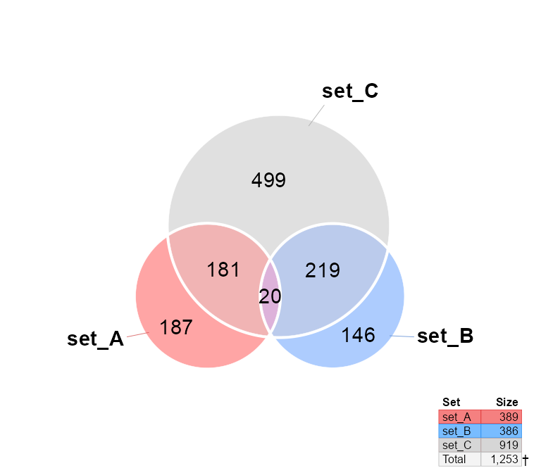

<!-- README.md is generated from README.Rmd. Please edit that file -->

# venndir

<!-- badges: start -->

<!-- badges: end -->

The goal of venndir is to enable directional Venn overlap analysis and
visualization.

## Installation

The development version of venndir can be installed with:

``` r
# install.packages("remotes")
remotes::install_github("jmw86069/venndir");
```

## Brief Overview of venndir

The `venndir` package includes a utility function `make_venn_test()` to
create test data.

``` r
library(venndir)
setlist <- make_venn_test(100, 3)
venndir(setlist)
```


The more interesting case uses directionality.

Note that `make_venn_tests()` can simulate concordance, and the default
is `concordance=0.5`. Concordance is defined by `(agree - disagree) /
(n)`, where `concordance=0` means there are the same number that agree
as disagree in direction, and `concordance=1` means every element agrees
in direction.

``` r
setlist <- make_venn_test(1000, 3, do_signed=TRUE)
venndir(setlist)
```


There are a few ways to represent concordance… sometimes you want to see
up-up, and down-down, and everything else is “mixed”. For that, use the
default `overlap_type="concordance"` (shown above.)

Another option is to show “agreement” and “mixed”, and for this case use
`overlap_type="agreement"` (below).

``` r
venndir(setlist, overlap_type="agreement")
```


The last option is to show the counts for each direction, by
`overlap_type="each"` (below).

``` r
venndir(setlist, overlap_type="each")
```


## Proportional directional Venn

You can even make a proportional Venn diagram, which uses the really
nice `eulerr` R package.

``` r
venndir(setlist, proportional=TRUE)
```


At this point, labeling is an issue, and the best current remedy is
manual adjustment. (In future, non-overlapping labels will be
available.)

The output of `venndir()` contains a `list` with the polygon
coordinates, and the label coordinates, so you can manually adjust as
needed.

Also, I really like having a function named `render_venndir()`.

``` r
venndir_output <- venndir(setlist, proportional=TRUE, do_plot=FALSE);

# get label coordinate data
label_df <- venndir_output$label_df;

# get polygon data
venn_spdf <- venndir_output$venn_spdf;

# adjust set_A&set_C
ac_rows <- which(label_df$overlap_set %in% "set_A&set_C");
label_df <- venndir_output$label_df;
label_df[ac_rows,"x"] <- label_df[ac_rows,"x"] - 4.2;
label_df[ac_rows,"y"] <- label_df[ac_rows,"y"] + 1.3;

# be fancy and add color background to the label
label_df[ac_rows,"fill"] <- jamba::alpha2col(data.frame(venn_spdf)["set_A&set_C","color"], alpha=0.5);
label_df[ac_rows,"border"] <- data.frame(venn_spdf)["set_A&set_C","color"];

render_venndir(venn_spdf=venn_spdf, label_df=label_df, font_cex=1.3)

lines(x=label_df[ac_rows[1],"x"] + c(1.5, 4.2),
   y=label_df[ac_rows[1],"y"] + c(-0.4, -1.3))
```


## Text Venn?

There is a text Venn diagram, surprisingly useful for quickly checking
overlaps and direction.

The first example is the basic Venn overlap, without direction.

``` r
textvenn(setlist, overlap_type="overlap")
#>                                set_A&set_B                                     
#>                                    27                                          
#>   set_A                                                              set_B     
#>    31                                                                 390      
#>                                                                                
#>                             set_A&set_B&set_C                                  
#>                                     7                                          
#>             set_A&set_C                              set_B&set_C               
#>                  6                                       76                    
#>                                                                                
#>                                                                                
#>                                   set_C                                        
#>                                    71
```

But of course direction is helpful, so here it is with the default
`overlap_type="concordance"` (below)

``` r
textvenn(setlist, overlap_type="concordance")
#>                                        set_A&set_B     ↑↑: 9                                          
#>                                            27          ↓↓: 12                                         
#>   set_A  ↑: 19                                          X: 6                           set_B  ↑: 185  
#>    31    ↓: 12                                                                          390   ↓: 205  
#>                                                                                                       
#>                                     set_A&set_B&set_C  ↑↑↑: 2                                         
#>                                             7           X: 5                                          
#>                 set_A&set_C  ↑↑: 2                                set_B&set_C  ↑↑: 39                 
#>                      6       ↓↓: 3                                    76       ↓↓: 21                 
#>                              X: 1                                              X: 16                  
#>                                                                                                       
#>                                           set_C        ↑: 30                                          
#>                                            71          ↓: 41
```

Not all consoles can display Unicode arrows, so you can use ASCII output
only with `unicode=FALSE`:

``` r
textvenn(setlist, overlap_type="concordance", unicode=FALSE)
#>                                        set_A&set_B     ^^: 9                                          
#>                                            27          vv: 12                                         
#>   set_A  ^: 19                                          X: 6                           set_B  ^: 185  
#>    31    v: 12                                                                          390   v: 205  
#>                                                                                                       
#>                                     set_A&set_B&set_C  ^^^: 2                                         
#>                                             7           X: 5                                          
#>                 set_A&set_C  ^^: 2                                set_B&set_C  ^^: 39                 
#>                      6       vv: 3                                    76       vv: 21                 
#>                              X: 1                                              X: 16                  
#>                                                                                                       
#>                                           set_C        ^: 30                                          
#>                                            71          v: 41
```

Sorry, no proportional text Venn diagrams (yet)\!

## Nudge Venn circles

Another driving reason for this package is that sometimes proportional
Venn (Euler) diagrams fail to produce circles that show all the
overlaps. While sometimes it is mathematically impossible, other times
are just… puzzling.

See below, the overlap `set_A&set_B` has 1 count, but is not displayed.

``` r
overlaps <- c(set_A=187, set_B=146, set_C=499,
   `set_A&set_B`=1,
   `set_A&set_C`=181,
   `set_B&set_C`=219,
   `set_A&set_B&set_C`=20);
overlap_list <- lapply(jamba::nameVectorN(overlaps), function(i){
   jamba::makeNames(rep(i, overlaps[[i]]))
})
setlist_o <- lapply(jamba::nameVector(c("set_A", "set_B", "set_C")), function(i){
   unname(jamba::vigrep(i, unlist(overlap_list)))
})
venndir(setlist_o, proportional=TRUE)
```



The argument `circle_nudge` lets you nudge (move) a Venn circle given
x,y coordinates.

``` r
venndir_output <- venndir(setlist_o,
   font_cex=2,
   proportional=TRUE,
   circle_nudge=list(set_A=c(2, 0)));
```


## Future work

I have been using this type of Venn diagram for several years, and one
feature I use a lot that I am still porting into this package is “item
labeling”. This option fills the Venn diagram with labels of the items
in each set. It works surprisingly well, even up to a few hundred
labels, depending upon the font size and figure size.

An interesting feature when displaying item labels, is that the
directional arrows can be used as a prefix, to see exactly which items
are “up-up” and which are “down-down” for example. It turns out to be a
pretty effective alternative to drawing a proportional Venn diagram,
since the density of labels gives a visual indication for which overlaps
are higher or lower.

Also, Venn diagrams have consistent layout, and do not fail to display
overlaps because the “proportional model fit” did not prioritize an
overlap.
