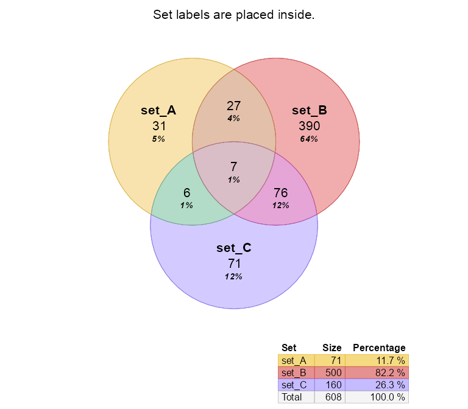
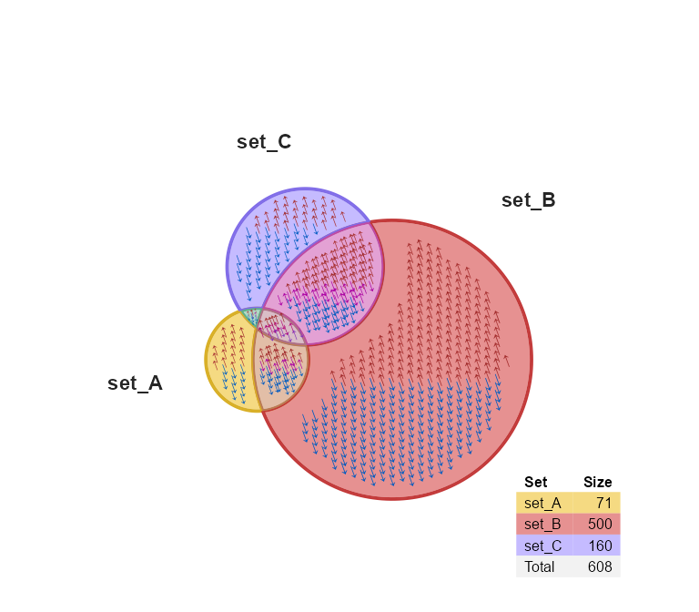

<!-- README.md is generated from README.Rmd. Please edit that file -->

# venndir

<!-- badges: start -->

<!-- badges: end -->

The goal of venndir is to enable directional Venn overlap analysis and
visualization.

## Installation

The development version of venndir can be installed with:

``` r
# install.packages("remotes")
remotes::install_github("jmw86069/venndir");
```

## Brief Overview of venndir

The `venndir` package includes a utility function `make_venn_test()` to
create test data.

``` r
library(venndir)
setlist <- make_venn_test(100, 3)
venndir(setlist)
```


You can make a proportional Venn diagram, also known as a Euler diagram.
More examples of proportional Venn diagrams are described below, with
custom options to manipulate the position of circles and labels.

``` r
venndir(setlist, proportional=TRUE)
```


The default output is a base R plot, but you can use `ggplot2` with
argument `plot_style="gg"`. The function returns the `ggplot` object
which can be manipulated alongside other `grid` graphical objects.

``` r
venndir(setlist, plot_style="gg")
#> ##  (23:40:13) 18Nov2020:  xlim:1.7,8.3, ylim:1.7,8.3
```


## Venn Direction

For a more interesting case, `make_venn_test()` can make sets where the
items have directionality, encoded with `1` for up, or `-1` for down.

For biological data, direction is important and relevant. Whether a gene
is regulated up or down might be the difference between disease and
treatment.

> Note `make_venn_tests()` can simulate concordance, and the default is
> `concordance=0.5`. Concordance is a measure of how frequently two
> directions are the same, and is defined `(agree - disagree) / (n)`.
> Thus, `concordance=0` means there are the same number that agree as
> disagree in direction, and `concordance=1` means every element agrees
> in direction.

There are a few ways to think about “concordance” – the measure of
agreement in direction, and so there are few ways to display concordance
inside a Venn diagram. The default argument `overlap_type="concordance"`
displays the number `up-up`, and the number `down-down`, and everything
else is considered “discordant”.

``` r
setlist <- make_venn_test(1000, 3, do_signed=TRUE)
venndir(setlist)
```


This style is effective for 3 or more sets, where the number of possible
discordant combinations may be too many to display comfortably. In this
case it is still useful to see how many agree up, and how many agree
down, the rest simply disagree.

Another option `overlap_type="each"` shows the count for every
combination. As said before, it works best for 2 or 3 sets.

``` r
venndir(setlist, overlap_type="each")
```


The option `overlap_type="agreement"` shows only “agreement” and
“mixed”, regardless of the direction. This option is especially good
at summarizing the number that agree and disagree.

``` r
venndir(setlist, overlap_type="agreement")
```


The last option simply turns off the display of direction,
`overlap_type="overlap"`.

``` r
venndir(setlist, overlap_type="overlap")
```


## Proportional Venn Direction

As shown above, you can switch output to a proportional Venn diagram,
which uses the really nice `eulerr` R package.

``` r
venndir(setlist, proportional=TRUE, distance=5, label_style="lite",
   font_cex=c(1.3, 1))
```


Labeling is often a challenge with proportional Venn diagrams. By
default, for directional Venn counts, if a polygon is less than 5% of
the total area, the label is placed outside. For standard Venn counts
the default threshold is 1%.

Below is the same diagram, showing only the overlap counts, and not the
directional counts.

``` r
venndir(setlist,
   proportional=TRUE,
   overlap_type="overlap",
   label_style="lite",
   font_cex=c(1.3, 1))
```


You can change the threshold for placing labels outside with the
argument `inside_percent_threshold`, which takes integer percent values
from 0 to 100.

``` r
venndir(setlist,
   proportional=TRUE,
   inside_percent_threshold=0.1,
   overlap_type="overlap",
   font_cex=c(1.3, 1))
```


## Customizing the Venn diagram

The output of `venndir()` is a `list` with:

  - `"venn_spdf"` - which contains polygon coordinates stored as a
    `sp::SpatialPolygonsDataFrame`. Essentially it stores each Venn
    polygon, with annotations in a `data.frame`.
  - `"label_df"` - a `data.frame` with individual text labels, colors,
    and coordinates.

You can edit the `label_df` data manually, as needed, then render the
Venn diagram using `render_venndir()`. (I really like having a function
named `render_venndir()`…)

``` r
setlist <- make_venn_test(1000, 3, do_signed=FALSE)
vo <- venndir(setlist, proportional=TRUE, do_plot=FALSE);

print(head(vo$label_df));
#>                      x         y text venn_counts overlap_set type  x_offset
#> set_A       -8.7294794 -1.522097   31          31       set_A main  0.000000
#> set_B        8.8551704 -4.377014  390         390       set_B main  0.000000
#> set_C       -4.6615851  9.950110   71          71       set_C main  0.000000
#> set_A&set_B -4.1398360 -2.239633   27          27 set_A&set_B main  0.000000
#> set_A&set_C -6.5909700  2.588698    6           6 set_A&set_C main -3.292144
#> set_B&set_C  0.1167125  4.733025   76          76 set_B&set_C main  0.000000
#>             y_offset show_label vjust hjust halign rot     color fontsize
#> set_A       0.000000         NA   0.5   0.5    0.5   0 #D9D9D9FF       14
#> set_B       0.000000         NA   0.5   0.5    0.5   0 #262626FF       14
#> set_C       0.000000         NA   0.5   0.5    0.5   0 #D9D9D9FF       14
#> set_A&set_B 0.000000         NA   0.5   0.5    0.5   0 #262626FF       14
#> set_A&set_C 1.422392         NA   0.5   0.5    0.5   0 #262626FF       14
#> set_B&set_C 0.000000         NA   0.5   0.5    0.5   0 #262626FF       14
#>             border lty lwd fill padding padding_unit r r_unit      overlap_sign
#> set_A           NA   1   1   NA       4           pt 4     pt       set_A|1 0 0
#> set_B           NA   1   1   NA       4           pt 4     pt       set_B|0 1 0
#> set_C           NA   1   1   NA       4           pt 4     pt       set_C|0 0 1
#> set_A&set_B     NA   1   1   NA       4           pt 4     pt set_A&set_B|1 1 0
#> set_A&set_C     NA   1   1   NA       4           pt 4     pt set_A&set_C|1 0 1
#> set_B&set_C     NA   1   1   NA       4           pt 4     pt set_B&set_C|0 1 1
#>                    items overlap   count show_items hjust_outside hjust_inside
#> set_A       item_052....  inside  inside       none           0.5          0.5
#> set_B       item_011....  inside  inside       none           0.5          0.5
#> set_C       item_059....  inside  inside       none           0.5          0.5
#> set_A&set_B item_019....    none  inside       none           0.5          0.5
#> set_A&set_C item_093....    none outside       none           1.0          0.5
#> set_B&set_C item_060....    none  inside       none           0.5          0.5
#>             vjust_outside vjust_inside
#> set_A                 0.5          1.0
#> set_B                 0.5          1.0
#> set_C                 0.5          1.0
#> set_A&set_B           0.5          0.5
#> set_A&set_C           0.0          0.5
#> set_B&set_C           0.5          0.5

vo$label_df[1:3,"border"] <- c("red4", "darkorange", "blue4");
vo$label_df[1:3,"fill"] <- c("red3", "darkorange2", "blue3");
render_venndir(vo);
```


A convenience function `venndir_label_style()` is provided which
provides two features:

1.  It can adjust a label positions and visibility using `label_preset`.
2.  It can adjust label visual style using `label_style`.

### venndir\_label\_style() and label\_preset

The `label_preset` has a few pre-configured options:

  - `"main inside"` - displays main set labels, and counts inside each
    polygon.
  - `"main outside"` - displays each set label outside, and counts
    inside.
  - `"outside"` - displays set labels and counts outside.
  - `"main items"` - displays set names outside, and item labels inside
    each polygon. See below for examples.

<!-- end list -->

``` r
vo4 <- venndir_label_style(vo,
   label_preset="main outside",
   inside_percent_threshold=0)
render_venndir(vo4);
```



You can hide line segments with `show_segments=FALSE`.

``` r
vo4l <- venndir_label_style(vo,
   label_preset="main outside",
   inside_percent_threshold=0)
render_venndir(vo4l,
   show_segments=FALSE);
```


### venndir\_label\_style() and label\_style

The `label_style` is used for visual effects, to improve visibility of
the text labels. It applies two basic operations, fill and border.

Fill options:

  - `"basic"` - removes background fill
  - `"shaded"` - partial transparent fill using the overlap color
  - `"fill"` - fill using the overlap color
  - `"lite"` - lite shaded fill
  - `"custom"` - will not update the fill, in case you manually adjusted
    these values

Border options:

  - `"box"` - will draw a border around each label *\`* `""` - absence
    of `"box"` in `label_style` will remove any border

The `label_style` string can be any string that contains those values,
for example:

  - `label_style="lite box"`
  - `label_style="shaded"`
  - `label_style="basic box"`

<!-- end list -->

``` r
vo3 <- venndir_label_style(vo,
   label_style="lite box")
render_venndir(vo3);
```


## Text Venn for the R Console

There is a text Venn diagram, surprisingly useful for quickly checking
overlaps and direction. Note that the R console, and R help examples
display colored text, just not in Rmarkdown.

The first example is the basic Venn overlap, without direction.

``` r
setlist <- make_venn_test(1000, 3, do_signed=TRUE)
textvenn(setlist, overlap_type="overlap")
#>                                set_A&set_B                                     
#>                                    27                                          
#>   set_A                                                              set_B     
#>    31                                                                 390      
#>                                                                                
#>                             set_A&set_B&set_C                                  
#>                                     7                                          
#>             set_A&set_C                              set_B&set_C               
#>                  6                                       76                    
#>                                                                                
#>                                                                                
#>                                   set_C                                        
#>                                    71
```

But of course direction is helpful, so here it is with the default
`overlap_type="concordance"` (below)

``` r
textvenn(setlist, overlap_type="concordance")
#>                                        set_A&set_B     ↑↑: 9                                          
#>                                            27          ↓↓: 12                                         
#>   set_A  ↑: 19                                          X: 6                           set_B  ↑: 185  
#>    31    ↓: 12                                                                          390   ↓: 205  
#>                                                                                                       
#>                                     set_A&set_B&set_C  ↑↑↑: 2                                         
#>                                             7           X: 5                                          
#>                 set_A&set_C  ↑↑: 2                                set_B&set_C  ↑↑: 39                 
#>                      6       ↓↓: 3                                    76       ↓↓: 21                 
#>                              X: 1                                              X: 16                  
#>                                                                                                       
#>                                           set_C        ↑: 30                                          
#>                                            71          ↓: 41
```

Not all consoles can display Unicode arrows, so you can use ASCII output
only with `unicode=FALSE`:

``` r
textvenn(setlist, overlap_type="concordance", unicode=FALSE)
#>                                        set_A&set_B     ^^: 9                                          
#>                                            27          vv: 12                                         
#>   set_A  ^: 19                                          X: 6                           set_B  ^: 185  
#>    31    v: 12                                                                          390   v: 205  
#>                                                                                                       
#>                                     set_A&set_B&set_C  ^^^: 2                                         
#>                                             7           X: 5                                          
#>                 set_A&set_C  ^^: 2                                set_B&set_C  ^^: 39                 
#>                      6       vv: 3                                    76       vv: 21                 
#>                              X: 1                                              X: 16                  
#>                                                                                                       
#>                                           set_C        ^: 30                                          
#>                                            71          v: 41
```

Sorry, no proportional text Venn diagrams (yet)\!

## Nudge Venn circles

Another driving reason for this package is that sometimes proportional
Venn (Euler) diagrams fail to produce circles that show all the
overlaps. While sometimes it is mathematically impossible, other times
are just… puzzling.

See below, the overlap `set_A&set_B` has 1 count, but is not displayed.

``` r
overlaps <- c(set_A=187, set_B=146, set_C=499,
   `set_A&set_B`=1,
   `set_A&set_C`=181,
   `set_B&set_C`=219,
   `set_A&set_B&set_C`=20);
# convert to setlist
setlist_o <- counts2setlist(overlaps)

venndir(setlist_o,
   proportional=TRUE,
   font_cex=1.4,
   set_colors=c("firebrick2", "dodgerblue", "#9999AA"))
```


The argument `circle_nudge` lets you nudge (move) a Venn circle given
x,y coordinates. Provide a `list` named by the set you want to move,
with a `numeric` vector for the `x,y` coordinates direction.

``` r
vo_nudge <- venndir(setlist_o,
   font_cex=1.4,
   proportional=TRUE,
   circle_nudge=list(set_A=c(1, 0), set_B=c(-1, 0)),
   set_colors=c("firebrick2", "dodgerblue", "#9999AA"))
```


## Item labels

An optional but useful feature is to include item labels inside the Venn
diagram. It helps answer the question, “What are those shared items?”
(In my experience, that’s a very early question.)

This step can also include the directional sign, which helps indicate
which items are shared, and whether they have the same direction. In
cases with too many labels to display, it is sometimes still useful to
display the sign, as a visual cue for the proportion of shared or
discordant signs.

Two arguments are required: the `label_preset` to define the visibility
of items and main set labels; and `show_items` to define the type of
item label. For example `label_preset="main items"` will display main
set labels outside, and item labels inside; and `show_items="item"` will
display the item label, `show_items="sign item"` will display the sign
and item label, `show_items="sign"` will display only the sign.

``` r
setlist <- make_venn_test(100, 3, do_signed=TRUE);
venndir(setlist,
   poly_alpha=0.3,
   label_preset="main items",
   show_items="sign item");
```


Interestingly, the density of labels gives some indication of the
relative overlaps.

The same plot using proportional circles makes the label density
effectively uniform:

``` r
setlist <- make_venn_test(100, 3, do_signed=TRUE);
venndir(setlist,
   poly_alpha=0.3,
   label_preset="main items",
   show_items="item",
   proportional=TRUE);
```


With too many features to label, it’s still interesting to indicate the
sign.

``` r
setlist <- make_venn_test(1000, 3, do_signed=TRUE);
venndir(setlist,
   label_preset="main items",
   show_items="sign",
   show_segments=FALSE,
   max_items=10000);
```


Again, proportional Venn circles effectively makes the density uniform.

``` r
venndir(setlist,
   label_preset="main items",
   overlap_type="each",
   show_items="sign",
   max_items=10000,
   show_segments=FALSE,
   proportional=TRUE);
```


