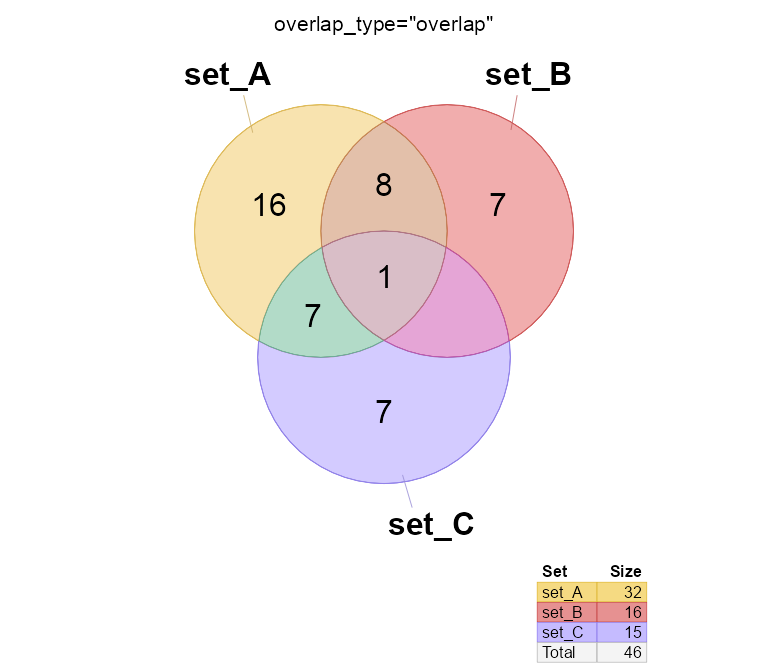
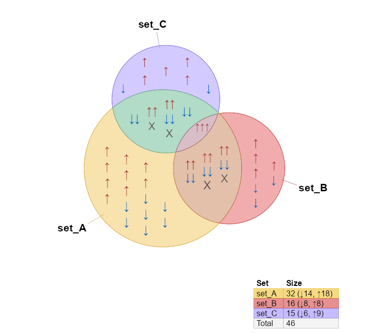

<!-- README.md is generated from README.Rmd. Please edit that file -->

# venndir

<!-- badges: start -->
<!-- badges: end -->

The `venndir` package provides Venn directional diagrams, that can
optionally display item labels inside the overlap regions.

The `pkgdown` reference:
[jmw86069.github.io/venndir](https://jmw86069.github.io/venndir)

## Installation

The development version of venndir can be installed with:

``` r
# install.packages("remotes")
remotes::install_github("jmw86069/venndir");
```

## Why Venndir?

Biological data often involves components, for example genes, and the
direction of change, for example increase or decrease. It is not enough
to compare genes affected by two experiments, it is critical to compare
the direction of change. How else can we discriminate the effects of
disease from the effects of a cure?

``` r
# silence the warnings
options("warn"=-1)

library(venndir)
vo <- venndir(make_venn_test(100, 2, do_signed=TRUE),
   proportional=TRUE,
   overlap_type="each", font_cex=1.2)
```


## Features of venndir

The core is `venndir()` which takes a `setlist` as input and produces a
Venn diagram. When the `setlist` contains directionality (sign), the
directional overlaps are also displayed.

To illustrate the point, `make_venn_test()` is used to create test
`setlist` data.

``` r
setlist <- make_venn_test(100, 3)
setlist
#> $set_A
#>  [1] "item_067" "item_042" "item_050" "item_043" "item_014" "item_025"
#>  [7] "item_090" "item_091" "item_069" "item_093" "item_057" "item_009"
#> [13] "item_072" "item_026" "item_007" "item_099" "item_089" "item_083"
#> [19] "item_036" "item_078" "item_097" "item_076" "item_015" "item_032"
#> [25] "item_086" "item_084" "item_041" "item_023" "item_027" "item_060"
#> [31] "item_053" "item_079"
#> 
#> $set_B
#>  [1] "item_053" "item_027" "item_096" "item_038" "item_089" "item_034"
#>  [7] "item_093" "item_069" "item_072" "item_076" "item_063" "item_013"
#> [13] "item_082" "item_025" "item_097" "item_021"
#> 
#> $set_C
#>  [1] "item_079" "item_041" "item_047" "item_090" "item_060" "item_095"
#>  [7] "item_016" "item_006" "item_072" "item_086" "item_091" "item_039"
#> [13] "item_031" "item_081" "item_050"
```

A `setlist` is a list of vectors. The names of the list, one for each
vector, are the set names. Each vector contains items which are the
subject of the Venn overlaps.

Given a `setlist`, you can create a Venn diagram with `venndir()`:

``` r
venndir(setlist)
```


You can make a proportional Venn diagram, also known as a Euler diagram.
Add argument `proportional=TRUE`.

``` r
vo <- venndir(setlist,
   proportional=TRUE)
```


## Venn Direction

The namesake of this package is Venn with directionality!

Test with: `make_venn_test(..., do_signed=TRUE)`. Each item is
associated with a numerical direction:

- `+1` for up
- `-1` for down

Each vector in `setlist_dir` is a named vector, whose **names** are the
items, and whose **values** are the direction, with `+1` or `-1`. Take a
look.

``` r
setlist_dir <- make_venn_test(100, 3, do_signed=TRUE)
setlist_dir
#> $set_A
#> item_067 item_042 item_050 item_043 item_014 item_025 item_090 item_091 
#>       -1        1        1       -1       -1        1       -1       -1 
#> item_069 item_093 item_057 item_009 item_072 item_026 item_007 item_099 
#>       -1        1        1       -1        1        1       -1       -1 
#> item_089 item_083 item_036 item_078 item_097 item_076 item_015 item_032 
#>       -1        1        1        1        1        1       -1        1 
#> item_086 item_084 item_041 item_023 item_027 item_060 item_053 item_079 
#>        1        1       -1        1       -1        1        1       -1 
#> 
#> $set_B
#> item_053 item_027 item_096 item_038 item_089 item_034 item_093 item_069 
#>        1       -1        1       -1       -1       -1        1       -1 
#> item_072 item_076 item_063 item_013 item_082 item_025 item_097 item_021 
#>        1        1        1        1        1       -1       -1       -1 
#> 
#> $set_C
#> item_079 item_041 item_047 item_090 item_060 item_095 item_016 item_006 
#>       -1       -1        1       -1        1        1        1       -1 
#> item_072 item_086 item_091 item_039 item_031 item_081 item_050 
#>        1        1        1        1       -1        1       -1
```

For biological data, direction is important and relevant. Whether a gene
is regulated up or down might be the difference between disease and
treatment.

> Note `make_venn_tests()` can simulate concordance, and the default is
> `concordance=0.5`. Concordance is a measure of how frequently two
> directions are the same, and is defined `(agree - disagree) / (n)`.
> Thus, `concordance=0` means there are the same number that agree as
> disagree in direction, and `concordance=1` means every element agrees
> in direction.

There are a few ways to summarize directional overlaps, which vary by
the amount of detail.

- `overlap_type="overlap"` - This method ignores direction.
- `overlap_type="agreement"` - This method displays agreement and
  disagreement, with no details about up/down direction.
- `overlap_type="concordance"` - **(default)** This method displays
  concordant directions, up-up, down-down; all discordant combinations
  are grouped together as “discordant”.
- `overlap_type="each"` - This method displays each directional overlap.

### overlap_type=“concordance”

This option displays the number `up-up`, and the number `down-down`, and
everything else is considered “discordant”. This approach is effective
at conveying direction, without too many details.

Notice the `"X"` to indicate discordance.

``` r
venndir(setlist_dir)
```


### overlap_type=“each”

This option shows the count for each combination. It works best when you
want to see all the details, however it can create a lot of labels!

``` r
venndir(setlist_dir, overlap_type="each")
```


### overlap_type=“agreement”

This option shows the count that agrees in direction, and the count that
disagrees in direction. It does not indicate whether the agreement is up
or down.

This option is especially good at summarizing the number that agree and
disagree, without including potentially confusing details.

``` r
venndir(setlist_dir, overlap_type="agreement")
```


### overlap_type=“overlap”

This option only displays the overlap count, ignoring direction.

``` r
venndir(setlist_dir, overlap_type="overlap")
```



## Proportional Venn Direction

As mentioned previously, you can display proportional Venn diagram, (a
Euler diagram), which uses the excellent `eulerr` R package. Add
argument `proportional=TRUE`.

``` r
vo <- venndir(setlist_dir,
   proportional=TRUE,
   font_cex=c(1.3, 0.9, 0.7))
```


Labeling is often a challenge with proportional Venn diagrams. For very
small regions, you can push the label outside with
`inside_percent_threshold=5`. This option will move labels outside when
the region is less than 5% of the total area.

``` r
venndir(setlist,
   proportional=TRUE,
   overlap_type="overlap",
   label_style="lite box",
   inside_percent_threshold=5,
   font_cex=c(1.3, 1))
```


## Customizing the Venn diagram

### Label styles

The argument `label_style` can be used to customize the label:

- `label_style="lite"` - adds lite shading behind each label
- `label_style="shaded"` - adds partially transparent shading
- `label_style="fill"` - adds solid colored shading
- `label_style="box"` - adds a small outline box around the label

Multiple terms can be combined, for example to add shading and a box:

- `label_style="shaded box"` - adds colored shading and a box outline

### Label position

Argument `show_labels` is used to position labels. Each letter defines a
type of label, and UPPERCASE or lowercase indicates where to place the
label.

- UPPERCASE = outside the Venn diagram
- lowercase = inside the Venn diagram

The letters:

- N = the set name
- C = the overlap count
- S = the signed overlap count(s)
- i = the overlapping items

Guidance:

- The default: `show_labels="Ncs"` will show \_N_ame outside, \_c_ounts
  inside. When \_s_igned labels are shown, they also appear inside.
  Signed labels are not shown when `overlap_type="overlap"`.
- Display all labels inside: `show_labels="ncs"`
- It works best to have the \_c_ounts and \_s_igned counts together,
  usually inside.
- To display items, `show_labels="Ni"` is recommended, to show \_N_ame
  outside, and \_i_tems inside. You can still use
  `show_items="sign item"` so that each item label will include the
  direction.
- When displaying items, the counts and signed counts are automatically
  moved outside. (There isn’t a great way to place item labels around
  the count labels. Maybe in future.)

``` r
vo4 <- venndir(setlist,
   show_labels="ncs",
   inside_percent_threshold=0)
```


Hide line segments with `show_segments=FALSE`

``` r
vo4l <- venndir(setlist,
   show_labels="Ncs",
   show_segments=FALSE,
   inside_percent_threshold=0)
```


## Text Venn for the R Console

There is a text Venn diagram, surprisingly useful for quickly checking
overlaps and direction. Note that the R console, and R help examples
display colored text, just not in Rmarkdown.

The first example is the basic Venn overlap, without direction.

``` r
# Options are used for the RMarkdown
# options("jam.htmlOut"=TRUE, "jam.comment"=FALSE)

setlist <- make_venn_test(1000, 3, do_signed=TRUE)
names(setlist) <- gsub("set_", "", names(setlist));
textvenn(setlist, overlap_type="overlap")
#>                    A&B                         
#>                    27                          
#>    A                                    B      
#>    31                                  390     
#>                                                
#>                   A&B&C                        
#>                     7                          
#>           A&C                  B&C             
#>            6                   76              
#>                                                
#>                                                
#>                     C                          
#>                    71
```

But of course direction is helpful, so here it is with the default
`overlap_type="concordance"` (below)

``` r
textvenn(setlist, overlap_type="concordance")
#>                            A&B   ↑↑: 9                                
#>                            27    ↓↓: 12                               
#>    A   ↑: 19                      X: 6                    B   ↑: 185  
#>    31  ↓: 12                                             390  ↓: 205  
#>                                                                       
#>                           A&B&C  ↑↑↑: 2                               
#>                             7     X: 5                                
#>               A&C  ↑↑: 2                    B&C  ↑↑: 39               
#>                6   ↓↓: 3                    76   ↓↓: 21               
#>                    X: 1                          X: 16                
#>                                                                       
#>                             C    ↑: 30                                
#>                            71    ↓: 41
```

Not all consoles can display Unicode arrows, so you can use ASCII output
only with `unicode=FALSE`:

``` r
textvenn(setlist, overlap_type="concordance", unicode=FALSE)
#>                            A&B   ^^: 9                                
#>                            27    vv: 12                               
#>    A   ^: 19                      X: 6                    B   ^: 185  
#>    31  v: 12                                             390  v: 205  
#>                                                                       
#>                           A&B&C  ^^^: 2                               
#>                             7     X: 5                                
#>               A&C  ^^: 2                    B&C  ^^: 39               
#>                6   vv: 3                    76   vv: 21               
#>                    X: 1                          X: 16                
#>                                                                       
#>                             C    ^: 30                                
#>                            71    v: 41

# Revert options
# options("jam.htmlOut"=FALSE, "jam.comment"=TRUE)
```

Sorry, no proportional text Venn diagrams (yet)!

## Nudge Venn circles

Another driving reason for this package is that sometimes proportional
Venn (Euler) diagrams fail to produce circles that show all the
overlaps. While sometimes it is mathematically impossible, other times
are just… puzzling.

See below, the overlap `set_A&set_B` has 1 count, but is not displayed.

``` r
overlaps <- c(set_A=187, set_B=146, set_C=499,
   `set_A&set_B`=1,
   `set_A&set_C`=181,
   `set_B&set_C`=219,
   `set_A&set_B&set_C`=20);
# convert to setlist
setlist_o <- counts2setlist(overlaps)

vn <- venndir(setlist_o,
   expand_fraction=0.15,
   proportional=TRUE,
   font_cex=1.4,
   set_colors=c("firebrick2", "dodgerblue", "#9999AA"))
```


The argument `circle_nudge` lets you nudge (move) a Venn circle given
x,y coordinates. Provide a `list` named by the set you want to move,
with a `numeric` vector for the `x,y` coordinates direction.

``` r
vo_nudge <- venndir(setlist_o,
   expand_fraction=0.15,
   # label_style="lite box",
   font_cex=1.4,
   proportional=TRUE,
   circle_nudge=list(set_A=c(1, 0), set_B=c(-1, 0)),
   set_colors=c("firebrick2", "dodgerblue", "#9999AA"))
```


## Item labels

An optional but useful feature is to include item labels inside the Venn
diagram. It helps answer the question, “What are those shared items?”
(In my experience, that’s a very early question.)

This step can also include the directional sign, which helps indicate
which items are shared, and whether they have the same direction. In
cases with too many labels to display, it is sometimes still useful to
display the sign, as a visual cue for the proportion of shared or
discordant signs.

Two changes are required:

1.  Argument `show_labels` must include `"i"` to indicate items should
    be included in the labels. Preferred options:

    - `"Ni"` which shows \_N_ame outside, and \_i_tems inside.
    - `"NCi"` which shows \_N_ame and \_C_ounts outside, and \_i_tems
      inside.

2.  Argument `show_items` should be one of

    - `"item"` - to show only the item label
    - `"sign item"` - to show the sign beside each item label
    - `"sign"` - to show only the item label

``` r
setlist <- make_venn_test(100, 3, do_signed=TRUE);
venndir(setlist,
   poly_alpha=0.3,
   show_labels="NCi",
   show_items="sign item");
```


Interestingly, the density of labels gives some indication of the
relative overlaps.

The same plot using proportional circles makes the label density
effectively uniform. Note the option `show_items="sign"` displays only
the directional arrow, and `item_cex=2` makes the arrows twice as large
as normal.

``` r
setlist <- make_venn_test(100, 3, do_signed=TRUE);
venndir(setlist,
   poly_alpha=0.3,
   show_labels="Ni",
   item_cex=2,
   show_items="sign",
   proportional=TRUE);
```



The sign is an interesting visual summary when there are too many labels
to display otherwise.

``` r
setlist <- make_venn_test(1000, 3, do_signed=TRUE);
venndir(setlist,
   show_labels="Ni",
   show_items="sign",
   item_cex=2,
   expand_fraction=0.1,
   show_segments=FALSE,
   max_items=10000);
```


Again, proportional Venn circles effectively makes the density uniform.

``` r
venndir(setlist,
   show_labels="Ni",
   overlap_type="each",
   show_items="sign",
   item_cex=2,
   expand_fraction=0.1,
   max_items=10000,
   show_segments=FALSE,
   proportional=TRUE)
```


