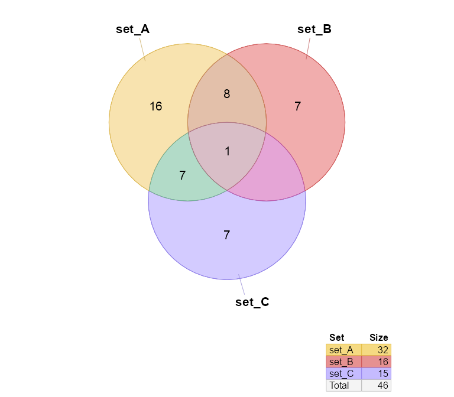

<!-- README.md is generated from README.Rmd. Please edit that file -->

# venndir

<!-- badges: start -->

<!-- badges: end -->

The goal of venndir is to enable directional Venn overlap analysis and
visualization.

## Installation

The development version of venndir can be installed with:

``` r
# install.packages("remotes")
remotes::install_github("jmw86069/venndir");
```

## Brief Overview of venndir

The `venndir` package includes a utility function `make_venn_test()` to
create test data.

``` r
library(venndir)
setlist <- make_venn_test(100, 3)
venndir(setlist)
```



The more interesting case uses directionality.

Note that `make_venn_tests()` can simulate concordance, and the default
is `concordance=0.5`. Concordance is defined by `(agree - disagree) /
(n)`, where `concordance=0` means there are the same number that agree
as disagree in direction, and `concordance=1` means every element agrees
in direction.

``` r
setlist <- make_venn_test(1000, 3, do_signed=TRUE)
venndir(setlist)
```


There are a few ways to represent concordance… sometimes you want to see
up-up, and down-down, and everything else is “mixed”. For that, use the
default `overlap_type="concordance"` (shown above.)

Another option is to show “agreement” and “mixed”, and for this case use
`overlap_type="agreement"` (below).

``` r
venndir(setlist, overlap_type="agreement")
```


The last option is to show the counts for each direction, by
`overlap_type="each"` (below).

``` r
venndir(setlist, overlap_type="each")
```


## Proportional directional Venn

You can even make a proportional Venn diagram, which uses the really
nice `eulerr` R package.

``` r
venndir(setlist, proportional=TRUE)
```


At this point, labeling is an issue, and the best current remedy is
manual placement of labels. So I’m trying to make it easy to move
labels.

The output of `venndir()` contains a `list` with the polygon
coordinates, and the label coordinates, so you can manually adjust as
needed.

Also, I really like having a function named `render_venndir()`.

``` r
setlist <- make_venn_test(1000, 3, do_signed=TRUE)
venndir_output <- venndir(setlist, proportional=TRUE, do_plot=FALSE);


# adjust set_A&set_C
venndir_output <- nudge_venndir_label(venndir_output,
   set=c("set_A&set_C"),
   x_offset=-4.6,
   y_offset=1.3,
   unit_type="absolute");
render_venndir(venndir_output)
```


When the label is moved outside the venn set polygon, a line segment is
automatically drawn to just inside the border.

Lastly, you can customize the label style, using
`venndir_label_style()`. There are two aspects to the label style:
background fill, and border outline.

For background fill, the options are:

  - `"basic"` or `"none"` which does not have background fill
  - `"lite"` which uses a default lite background color
  - `"shaded"` which uses semi-transparent fill using the polygon color
  - `"fill"` which uses opaque fill using the polygon color

For the border, include `"box"` somewhere in the `label_style`.

Examples: `label_style="lite box"`, `label_style="shaded"`,
`label_style="basic"`.

``` r
venndir_output <- venndir_label_style(venndir_output,
   label_style="lite box")
render_venndir(venndir_output);
```


## Text Venn?

There is a text Venn diagram, surprisingly useful for quickly checking
overlaps and direction. Note that the R console, and R help examples
display colored text, just not in Rmarkdown.

The first example is the basic Venn overlap, without direction.

``` r
textvenn(setlist, overlap_type="overlap")
#>                                set_A&set_B                                     
#>                                    27                                          
#>   set_A                                                              set_B     
#>    31                                                                 390      
#>                                                                                
#>                             set_A&set_B&set_C                                  
#>                                     7                                          
#>             set_A&set_C                              set_B&set_C               
#>                  6                                       76                    
#>                                                                                
#>                                                                                
#>                                   set_C                                        
#>                                    71
```

But of course direction is helpful, so here it is with the default
`overlap_type="concordance"` (below)

``` r
textvenn(setlist, overlap_type="concordance")
#>                                        set_A&set_B     ↑↑: 9                                          
#>                                            27          ↓↓: 12                                         
#>   set_A  ↑: 19                                          X: 6                           set_B  ↑: 185  
#>    31    ↓: 12                                                                          390   ↓: 205  
#>                                                                                                       
#>                                     set_A&set_B&set_C  ↑↑↑: 2                                         
#>                                             7           X: 5                                          
#>                 set_A&set_C  ↑↑: 2                                set_B&set_C  ↑↑: 39                 
#>                      6       ↓↓: 3                                    76       ↓↓: 21                 
#>                              X: 1                                              X: 16                  
#>                                                                                                       
#>                                           set_C        ↑: 30                                          
#>                                            71          ↓: 41
```

Not all consoles can display Unicode arrows, so you can use ASCII output
only with `unicode=FALSE`:

``` r
textvenn(setlist, overlap_type="concordance", unicode=FALSE)
#>                                        set_A&set_B     ^^: 9                                          
#>                                            27          vv: 12                                         
#>   set_A  ^: 19                                          X: 6                           set_B  ^: 185  
#>    31    v: 12                                                                          390   v: 205  
#>                                                                                                       
#>                                     set_A&set_B&set_C  ^^^: 2                                         
#>                                             7           X: 5                                          
#>                 set_A&set_C  ^^: 2                                set_B&set_C  ^^: 39                 
#>                      6       vv: 3                                    76       vv: 21                 
#>                              X: 1                                              X: 16                  
#>                                                                                                       
#>                                           set_C        ^: 30                                          
#>                                            71          v: 41
```

Sorry, no proportional text Venn diagrams (yet)\!

## Nudge Venn circles

Another driving reason for this package is that sometimes proportional
Venn (Euler) diagrams fail to produce circles that show all the
overlaps. While sometimes it is mathematically impossible, other times
are just… puzzling.

See below, the overlap `set_A&set_B` has 1 count, but is not displayed.

``` r
overlaps <- c(set_A=187, set_B=146, set_C=499,
   `set_A&set_B`=1,
   `set_A&set_C`=181,
   `set_B&set_C`=219,
   `set_A&set_B&set_C`=20);
# convert to setlist
setlist_o <- counts2setlist(overlaps)

venndir(setlist_o,
   proportional=TRUE,
   set_colors=c("red", "blue", "#9999AA"))
```


The argument `circle_nudge` lets you nudge (move) a Venn circle given
x,y coordinates.

``` r
venndir_output <- venndir(setlist_o,
   font_cex=2,
   proportional=TRUE,
   circle_nudge=list(set_A=c(1, 0), set_B=c(-1, 0)),
   set_colors=c("red", "blue", "#9999AA"))
```


## Item labels

An optional but useful feature is to include item labels inside the Venn
diagram. It helps answer the question, “What are those shared items?”
(In my experience, that’s a very early question.)

This step can also include the directional sign, which helps indicate
which items are shared, and whether they have the same direction. In
cases with too many labels to display, it is sometimes still useful to
display the sign, as a visual cue for the proportion of shared or
discordant signs.

``` r
setlist <- make_venn_test(100, 3, do_signed=TRUE);
venndir(setlist,
   show_items="sign item");
```


Interestingly, the density of labels gives some indication of the
relative overlaps.

The same plot using proportional circles makes the label density
effectively uniform:

``` r
setlist <- make_venn_test(100, 3, do_signed=TRUE);
venndir(setlist,
   show_items="item",
   proportional=TRUE);
```


With too many features to label, it’s still interesting to indicate the
sign.

``` r
setlist <- make_venn_test(5000, 3, do_signed=TRUE);
venndir(setlist,
   show_items="sign",
   max_items=10000);
```


Again, proportional Venn circles effectively makes the density uniform.

``` r
venndir(setlist,
   overlap_type="each",
   show_items="sign",
   max_items=10000,
   proportional=TRUE);
```


